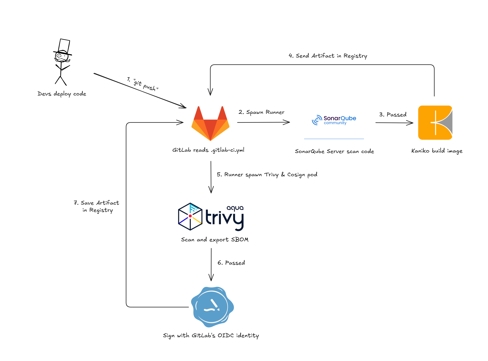

# Secure Cloud-Native Landing Zone & CI/CD Pipeline

This project is a PoC for building a secure cloud-native platform foundation on GCP using Infrastructure as Code. It provisions the underlying infrastructure, CI/CD components, internal registry, and a lightweight Kubernetes runtime with K3s, while serving as a base for GitOps delivery and Kubernetes scaling.

## Demo

- Provision Landing Zone: [Click here](https://drive.google.com/file/d/1v8VJ9Om-mrVmVHPzB5i8rH_V69TuPqS4/view?usp=sharing)

## Tech Stack

- **Terraform**: Defines where the infrastructure runs and how the network is structured.
- **Ansible**: Defines what each VM becomes after provisioning, helping reduce dependency on cloud-specific managed services and keeping system configuration more portable across environments.
- **GCP**: Target cloud platform for the landing zone, including VPC networking, firewall rules, routes, and Compute Engine VMs.
- **Checkov**: Acts as the first security gate by scanning Terraform and Ansible configurations before deployment.
- **Envoy**: Reverse proxy at the public edge, acting as the single external entrypoint into the private network.
- **Coraza WASM**: WAF layer attached to Envoy for HTTP traffic inspection and protection.
- **GitLab**: Serves as both the CI engine and internal container registry.
- **K3s**: Lightweight Kubernetes runtime for workloads and GitLab Runner execution.
- **Kaniko / Cosign / Trivy**: Enables daemonless image builds, image signing, and vulnerability scanning within the CI pipeline.
- **SonarQube**: Enforces source code quality gates before artifacts are built.

## Infrastructure

The platform is divided into three isolated layers: a public edge layer with Envoy/Coraza as the only Internet-facing entry point, a private workload layer running K3s, and a private management layer hosting GitLab CE, SonarQube as SAST tool, and the internal registry.

Firewall rules follow a deny-by-default approach, only allowing the required CI/CD traffic between GitLab, SonarQube, K3s/GitLab Runner, and the internal registry.

## CI Flow

This CI pipeline implements a secure DevSecOps workflow on K3s using GitLab CI, SonarQube, Kaniko, Trivy, and Cosign.  

Every pushed commit is automatically scanned, containerized, vulnerability-checked, SBOM-generated, and cryptographically signed before being stored in the internal GitLab Registry.

## Current states

### Completed
- Infrastructure provisioning with Terraform, Ansible, and Checkov
- Automated network, firewall, VM, and K3s cluster setup

### Currently Working On
- Full GitLab CI pipeline integration with SonarQube, Kaniko, Trivy, Cosign, and internal Registry workflows

### Planned Improvements
- Dynamic TLS hardening and stronger secret management
- GitOps-based CD pipeline using FluxCD
- Advanced K3s scaling, scheduling, and workload optimization
